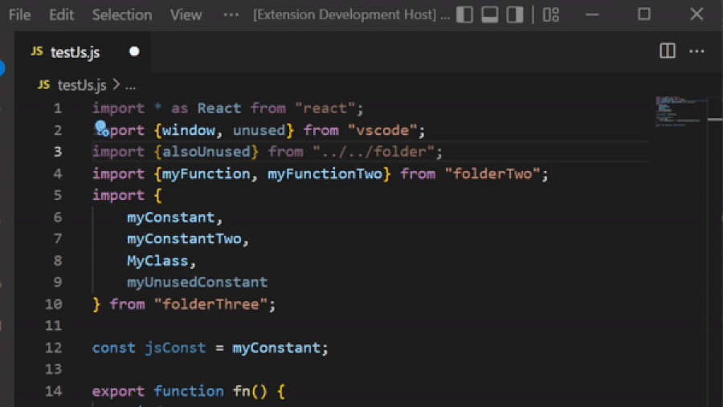
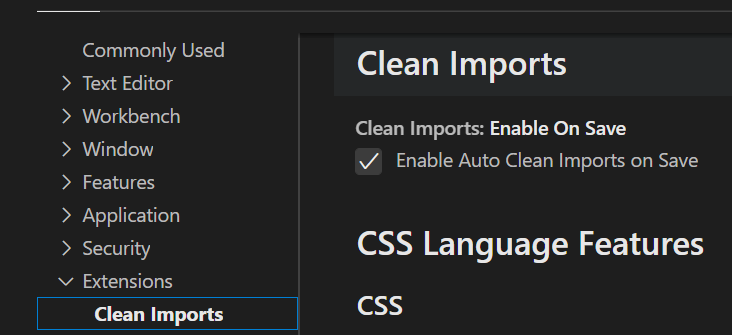
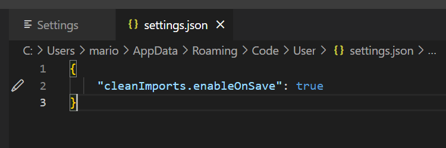
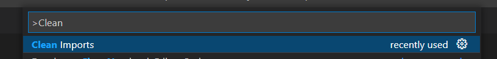

# Clean Imports

## Description

VS Code extension to clean the imports of JavaScript and TypeScript files (`.js`, `.jsx`, `.ts` and `.tsx`). The main difference with the "Organize Imports" of VS Code is that it doesn't re-sort the imports or adds spaces before and after the curly braces. The extension is triggered by default on saving (configurable in the extension settings) or by the Command Palette (a keybinding can be assigned there with the cog icon).

## How to Use

The extension will be triggered when saving a file with one of the file extension mentioned in the description.
This can be toggled in the settings:

or in the settings.json:

The command can also be separately triggered from the Command Palette. The command **ignores** the setting to trigger the extension on save:

## Limitations

If multiple files with pending changes are open and "Save All" is triggered then the extension will clean the imports only of the **visible editor** and not all of them.

## License

This project is licensed under the [MIT License](LICENSE).